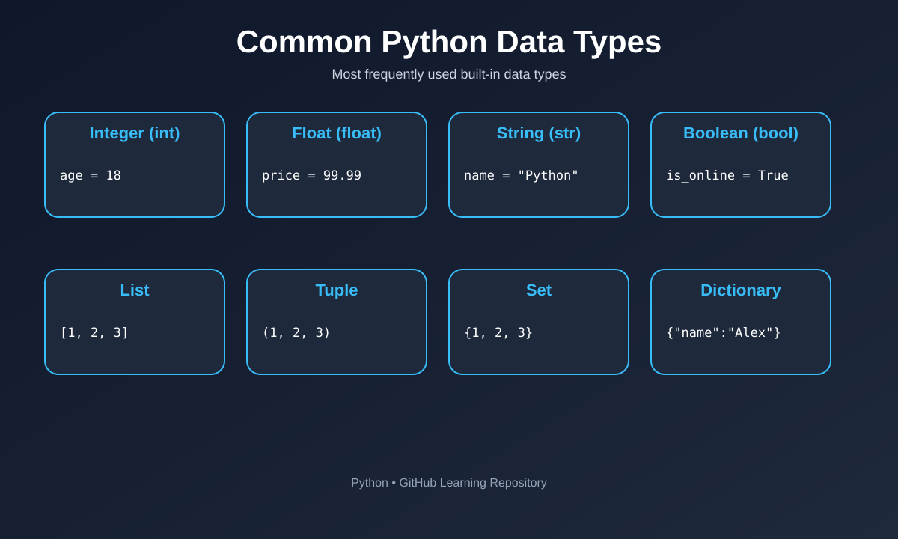

# Data Types

## Overview

Every value in Python has a type, which tells Python what kind of data it is and what operations can be performed on it. Python figures out the type automatically based on the value you assign — this is called **dynamic typing**.

---

## Syntax

```python
variable_name = value
```

The type is decided by the value itself, not by any keyword:

```python
age = 25          # int
price = 19.99     # float
name = "Claude"   # str
is_active = True  # bool
```

---

## Visual Explanation


---

## Python's Built-in Data Types

### 1. Numeric Types

```python
whole_number = 10        # int
decimal_number = 10.5    # float
complex_number = 2 + 3j  # complex
```

### 2. Text Type

```python
message = "Hello, Python!"   # str
```

### 3. Boolean Type

```python
is_valid = True    # bool
is_empty = False
```

### 4. Sequence Types

```python
fruits_list = ["apple", "banana", "cherry"]   # list - changeable, ordered
fruits_tuple = ("apple", "banana", "cherry")  # tuple - unchangeable, ordered
```

### 5. Mapping Type

```python
person = {"name": "Alice", "age": 30}   # dict - key-value pairs
```

### 6. Set Types

```python
unique_numbers = {1, 2, 3, 4}   # set - unordered, no duplicates
```

### 7. None Type

```python
result = None   # represents "no value"
```

---

## Checking Type

```python
x = 25
print(type(x))   # <class 'int'>

y = "Python"
print(type(y))   # <class 'str'>
```

---

## Type Conversion (Casting)

You can convert one data type into another using built-in functions:

```python
x = "10"
y = int(x)      # converts string to int -> 10

a = 25
b = str(a)      # converts int to string -> "25"

c = "3.14"
d = float(c)    # converts string to float -> 3.14
```

---

## Common Mistakes (and Fixes)

### 1. Assuming numbers in quotes are numbers

```python
# Wrong - this is a string, not a number
age = "25"
next_year = age + 1
```
```python
# Correct
age = 25
next_year = age + 1
```
`"25"` is text, not a number. Adding `1` to a string raises a `TypeError` unless converted first.

---

### 2. Mixing strings and numbers without converting

```python
# Wrong
score = 90
print("Your score is " + score)
```
```python
# Correct
score = 90
print("Your score is " + str(score))
```
Python cannot join a string and an integer with `+` directly — convert the number to a string first.

---

### 3. Confusing a list with a tuple

```python
# Wrong - trying to change a tuple
colors = ("red", "green", "blue")
colors[0] = "yellow"   # TypeError
```
```python
# Correct - use a list if you need to change values
colors = ["red", "green", "blue"]
colors[0] = "yellow"
```
Tuples are immutable (unchangeable) once created; lists are mutable.

---

### 4. Forgetting that division always returns a float

```python
# Common confusion
result = 10 / 2
print(result)   # 5.0, not 5
```
```python
# Use // for integer (floor) division if you want a whole number
result = 10 // 2
print(result)   # 5
```
The `/` operator always returns a `float` in Python 3, even if the result is a whole number.

---

### 5. Using `==` to check type instead of `type()` or `isinstance()`

```python
# Wrong / unreliable
x = 5
if x == int:
    print("It's an integer")
```
```python
# Correct
x = 5
if isinstance(x, int):
    print("It's an integer")
```
`==` compares values, not types. Use `isinstance()` or `type()` to check a variable's type.

---

### 6. Thinking `input()` returns a number

```python
# Wrong
age = input("Enter your age: ")
next_year = age + 1   # TypeError
```
```python
# Correct
age = int(input("Enter your age: "))
next_year = age + 1
```
`input()` always returns a string, even if the user types digits — convert it explicitly.

---

## Key Points

- Every value has a type; Python assigns it automatically.
- Use `type()` to check a variable's type, and `isinstance()` for type comparisons.
- Convert between types using `int()`, `float()`, `str()`, `list()`, `tuple()`, etc.
- Lists are mutable; tuples are not.
- `input()` always returns a string — convert it if you need a number.

---

## Practice Questions

### Easy

1. Create four variables holding an `int`, a `float`, a `str`, and a `bool`. Print the type of each using `type()`.
2. Convert the string `"100"` into an integer and add `50` to it. Print the result.
3. Create a list of three of your favorite foods, then print its type.
4. Create a tuple with three numbers. Try to change one value and observe what error Python gives.
5. Fix this broken code:
   ```python
   score = 95
   print("Score: " + score)
   ```

### Intermediate

1. Take a number as input from the user using `input()` and print its type, then convert it to an `int` and print the type again.
2. Create a dictionary representing a student with keys `name`, `age`, and `grade`. Print only the `name`.
3. Given `x = 7` and `y = 2`, print the result of `x / y` and `x // y`. Explain the difference in your own words.
4. Write code that checks whether a variable `value = 10` is an `int` using `isinstance()`, and prints a message accordingly.
5. Create a set from the list `[1, 2, 2, 3, 3, 3]` and print it. What do you notice about the output?

### Advanced

1. Write a program that asks the user for two numbers using `input()`, converts them to `float`, and prints their sum, difference, product, and quotient.
2. Given a list `data = ["10", "20", "30"]` (all strings), convert every element to an integer and calculate their total using a loop.
3. Create a dictionary of 3 items and a list of the same 3 items. Write code that checks the type of each and prints whether it's mutable or immutable.
4. Without running it, predict the output and explain why:
   ```python
   x = 5
   y = "5"
   print(x == y)
   print(x == int(y))
   ```
5. Write a small program that takes user input, tries to convert it to an `int` using `try`/`except`, and prints "Valid number" or "Invalid input, please enter a number" accordingly.

---

## Next Module

Proceed to **Input and Output** to learn how Python programs interact with users.