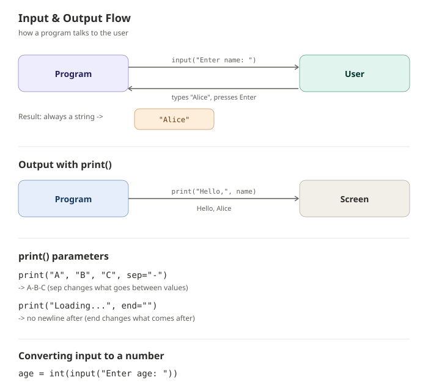

# Input and Output

## Overview

Programs become useful when they can talk to the user. **Input** lets a program receive data typed by the user, and **output** lets it display results back. Python handles this with two built-in functions: `input()` and `print()`.

---

## Syntax

```python
# Output
print(value)

# Input
variable_name = input(prompt)
```

- `print()` → displays text/values on the screen
- `input()` → pauses the program, waits for the user to type something, and returns it **as a string**

```python
name = input("Enter your name: ")
print("Hello,", name)
```

---

## Visual Explanation



---

## Output with `print()`

```python
print("Hello, World!")           # simple text
print("Score:", 95)              # multiple values, space-separated
print("A", "B", "C", sep="-")    # custom separator -> A-B-C
print("Loading...", end="")      # no newline after this print
print("Done")
```

Common `print()` parameters:

| Parameter | Purpose | Default |
|---|---|---|
| `sep` | separator between multiple values | `" "` (space) |
| `end` | what to print after the values | `"\n"` (newline) |

### f-strings (formatted output)

```python
name = "Alice"
age = 25
print(f"{name} is {age} years old.")   # Alice is 25 years old.
```

---

## Input with `input()`

```python
name = input("Enter your name: ")
print("Welcome,", name)
```

`input()` **always returns a string**, even if the user types a number:

```python
age = input("Enter your age: ")
print(type(age))   # <class 'str'>
```

To use it as a number, convert it explicitly:

```python
age = int(input("Enter your age: "))
print(age + 1)
```

---

## Common Mistakes (and Fixes)

### 1. Forgetting that `input()` always returns a string

```python
# Wrong
age = input("Enter your age: ")
next_year = age + 1   # TypeError: can only concatenate str
```
```python
# Correct
age = int(input("Enter your age: "))
next_year = age + 1
```

---

### 2. Trying to add a string and a number in `print()`

```python
# Wrong
score = 95
print("Score: " + score)
```
```python
# Correct - use a comma, str(), or an f-string
print("Score:", score)
print("Score: " + str(score))
print(f"Score: {score}")
```
`+` requires both sides to be the same type; a comma in `print()` handles mixed types automatically.

---

### 3. Forgetting parentheses (Python 2 habit)

```python
# Wrong (Python 2 syntax)
print "Hello"
```
```python
# Correct (Python 3 syntax)
print("Hello")
```
In Python 3, `print` is a function and always needs parentheses.

---

### 4. Expecting `input()` to validate data automatically

```python
# Wrong - crashes if the user types letters instead of numbers
age = int(input("Enter your age: "))
```
```python
# Correct - validate with try/except
try:
    age = int(input("Enter your age: "))
except ValueError:
    print("Please enter a valid number.")
```
Python doesn't check what the user types — invalid input causes a `ValueError` unless you handle it.

---

### 5. Overwriting the prompt text as the variable

```python
# Wrong - confusing prompt with the stored value
input = input("Enter name: ")   # this overwrites the input() function itself!
```
```python
# Correct - use a different variable name
name = input("Enter name: ")
```
Never name a variable `input` (or `print`, `list`, `str`, etc.) — it shadows the built-in function.

---

### 6. Missing space in the prompt string

```python
# Wrong - output reads "Enter your name:Alice"
name = input("Enter your name:")
```
```python
# Correct
name = input("Enter your name: ")
```
Add a trailing space in the prompt so user input doesn't run into the prompt text.

---

## Key Points

- `print()` sends output to the screen; `input()` reads input from the user.
- `input()` always returns a string — convert with `int()` or `float()` if you need a number.
- Use `sep` and `end` in `print()` to control formatting.
- f-strings (`f"{variable}"`) are the cleanest way to combine text and variables.
- Always consider validating user input with `try`/`except` to avoid crashes.

---

## Practice Questions

### Easy

1. Write a program that asks for the user's name and prints "Hello, `<name>`!".
2. Print the numbers `1`, `2`, and `3` on the same line separated by commas using `print()`'s `sep` parameter.
3. Ask the user for their favorite color and print it back using an f-string.
4. Print `"Loading"` followed by three dots on the same line using `end=""`, each printed separately.
5. Fix this broken code:
   ```python
   name = input("Enter your name:")
   print "Hi " + name
   ```

### Intermediate

1. Ask the user for their age using `input()`, convert it to an integer, and print how old they'll be in 10 years.
2. Write a program that takes two numbers as input, converts them to `float`, and prints their sum using an f-string.
3. Take a full name as input and print the first and last name on separate lines using `print()`.
4. Ask the user to enter three favorite fruits (one `input()` call each) and print them all on one line separated by `" | "`.
5. Explain, in your own words, why this code fails, and rewrite it correctly:
   ```python
   height = input("Enter height in cm: ")
   print("Height in meters:", height / 100)
   ```

### Advanced

1. Write a simple calculator: ask the user for two numbers and an operator (`+`, `-`, `*`, `/`), then print the result. Handle invalid operators with an `if`/`elif`/`else`.
2. Write a program that repeatedly asks the user to enter a number until they type `"stop"`, keeping a running total, then prints the final sum. Use `try`/`except` to skip invalid entries.
3. Ask the user to enter their birth year, calculate their age using the current year, and print a formatted message using an f-string.
4. Write a program that takes a sentence as input and prints the number of words in it and the number of characters (without spaces).
5. Without running it, predict the output and explain why:
   ```python
   x = input("Enter a number: ")   # user types 5
   y = input("Enter another: ")    # user types 3
   print(x + y)
   ```

---

## Next Module

Proceed to **Operators** to learn how Python performs calculations and comparisons on data.