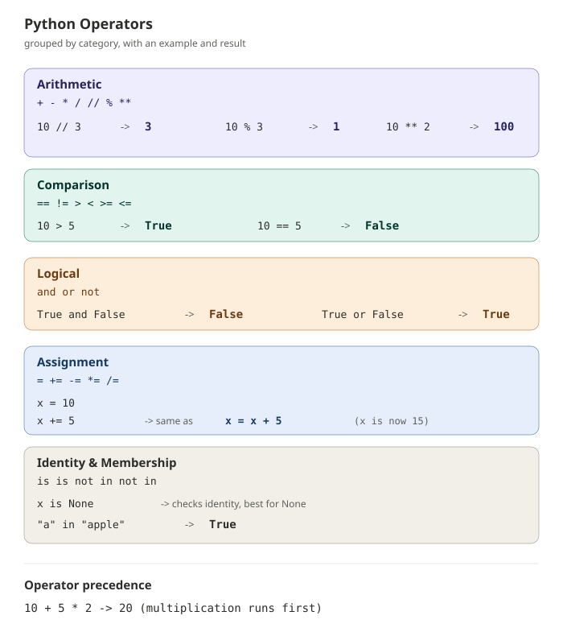

# Operators

## Overview

Operators are special symbols that perform operations on values and variables — like doing math, comparing values, or combining conditions. Python groups operators into several categories based on what they do.

---

## Syntax

```python
result = value1 operator value2
```

```python
total = 10 + 5      # arithmetic operator
is_equal = 10 == 5  # comparison operator
valid = True and False   # logical operator
```

---

## Visual Explanation



---

## 1. Arithmetic Operators

Used to perform mathematical calculations.

| Operator | Meaning | Example | Result |
|---|---|---|---|
| `+` | Addition | `5 + 3` | `8` |
| `-` | Subtraction | `5 - 3` | `2` |
| `*` | Multiplication | `5 * 3` | `15` |
| `/` | Division (always returns float) | `5 / 2` | `2.5` |
| `//` | Floor division (whole number) | `5 // 2` | `2` |
| `%` | Modulus (remainder) | `5 % 2` | `1` |
| `**` | Exponent (power) | `5 ** 2` | `25` |

```python
a = 10
b = 3
print(a + b, a - b, a * b, a / b, a // b, a % b, a ** b)
```

---

## 2. Comparison Operators

Compare two values and return `True` or `False`.

| Operator | Meaning | Example | Result |
|---|---|---|---|
| `==` | Equal to | `5 == 5` | `True` |
| `!=` | Not equal to | `5 != 3` | `True` |
| `>` | Greater than | `5 > 3` | `True` |
| `<` | Less than | `5 < 3` | `False` |
| `>=` | Greater than or equal to | `5 >= 5` | `True` |
| `<=` | Less than or equal to | `5 <= 3` | `False` |

```python
x = 10
y = 20
print(x == y)   # False
print(x < y)    # True
```

---

## 3. Logical Operators

Combine multiple conditions.

| Operator | Meaning | Example | Result |
|---|---|---|---|
| `and` | True if **both** conditions are true | `5 > 3 and 2 > 1` | `True` |
| `or` | True if **at least one** condition is true | `5 > 3 or 2 < 1` | `True` |
| `not` | Reverses the result | `not(5 > 3)` | `False` |

```python
age = 25
has_id = True
print(age >= 18 and has_id)   # True
```

---

## 4. Assignment Operators

Assign and update values in one step.

| Operator | Example | Equivalent To |
|---|---|---|
| `=` | `x = 5` | `x = 5` |
| `+=` | `x += 3` | `x = x + 3` |
| `-=` | `x -= 3` | `x = x - 3` |
| `*=` | `x *= 3` | `x = x * 3` |
| `/=` | `x /= 3` | `x = x / 3` |

```python
score = 10
score += 5   # score is now 15
```

---

## 5. Identity and Membership Operators

| Operator | Meaning | Example |
|---|---|---|
| `is` | True if both refer to the same object | `x is y` |
| `is not` | True if they don't refer to the same object | `x is not y` |
| `in` | True if a value exists in a sequence | `"a" in "apple"` |
| `not in` | True if a value does not exist in a sequence | `"z" not in "apple"` |

```python
fruits = ["apple", "banana"]
print("apple" in fruits)      # True
print("mango" not in fruits)  # True
```

---

## Common Mistakes (and Fixes)

### 1. Confusing `=` (assignment) with `==` (comparison)

```python
# Wrong
if age = 18:
    print("Adult")
```
```python
# Correct
if age == 18:
    print("Adult")
```
`=` assigns a value; `==` checks equality. Using `=` inside a condition is a syntax error in Python.

---

### 2. Expecting `/` to return a whole number

```python
# Confusing result
result = 10 / 3
print(result)   # 3.3333333333333335
```
```python
# Use // for a whole number (floor division)
result = 10 // 3
print(result)   # 3
```
`/` always returns a `float`, even when dividing evenly. Use `//` when you specifically want an integer result.

---

### 3. Forgetting operator precedence

```python
# Might not give the expected result
result = 10 + 5 * 2
print(result)   # 20, not 30
```
```python
# Use parentheses to be explicit
result = (10 + 5) * 2
print(result)   # 30
```
Python follows standard math precedence (`**` > `* / // %` > `+ -`). Use parentheses when in doubt.

---

### 4. Using `&` / `|` instead of `and` / `or`

```python
# Wrong (bitwise operators, not logical)
if age > 18 & has_id:
    print("Allowed")
```
```python
# Correct
if age > 18 and has_id:
    print("Allowed")
```
`&` and `|` are bitwise operators for numbers, not logical operators for conditions. Use `and`/`or` for boolean logic.

---

### 5. Using `==` to compare with `None`

```python
# Works, but not the recommended style
if value == None:
    print("No value")
```
```python
# Correct / Pythonic style
if value is None:
    print("No value")
```
`is` checks identity and is the recommended way to compare with `None`, since `None` is a singleton object.

---

### 6. Chained comparisons misunderstood

```python
# Looks odd but is valid Python — many beginners don't realize this works
x = 5
print(1 < x < 10)   # True
```
```python
# Equivalent long form
print(1 < x and x < 10)   # True
```
Python allows chained comparisons like `1 < x < 10` directly — no need to write it out with `and`.

---

## Key Points

- Arithmetic operators perform calculations; `/` always returns a float, `//` returns a whole number.
- Comparison operators return `True`/`False` and are often used in `if` statements.
- Logical operators (`and`, `or`, `not`) combine multiple conditions.
- Use `is`/`is not` for identity checks (especially with `None`), and `in`/`not in` for membership checks.
- Operator precedence follows standard math rules — use parentheses to make intent clear.

---

## Practice Questions

### Easy

1. Create two variables `a = 8` and `b = 3`. Print the result of `+`, `-`, `*`, `/`, `//`, `%`, and `**` between them.
2. Write a comparison that checks whether `15` is greater than `10`. Print the result.
3. Create a variable `is_sunny = True` and `has_umbrella = False`. Use `and` to check if both are true.
4. Check if the string `"cat"` exists inside the list `["dog", "cat", "bird"]` using `in`.
5. Fix this broken code:
   ```python
   x = 10
   if x = 10:
       print("Match")
   ```

### Intermediate

1. Write code that checks whether a number `n = 7` is even or odd using the `%` operator.
2. Given `price = 100`, apply a `10%` discount using `-=` and print the final price.
3. Use a chained comparison to check whether a variable `age = 25` is between `18` and `60`.
4. Create two variables `x = None` and check whether `x is None`. Then reassign `x = 5` and check again.
5. Predict the output and explain why:
   ```python
   result = 10 + 5 * 2 - 3
   print(result)
   ```

### Advanced

1. Write a program that takes a number as input and determines whether it's positive, negative, or zero using comparison and logical operators.
2. Write a simple password checker: given a stored password `"python123"`, ask the user to input a password and use `==` to check if it matches, printing "Access granted" or "Access denied".
3. Given two lists `list1 = [1, 2, 3]` and `list2 = [1, 2, 3]`, check whether `list1 == list2` and whether `list1 is list2`. Explain the difference in the output.
4. Write a program that checks divisibility: given a number, print whether it is divisible by `3`, `5`, both, or neither, using `%` and logical operators.
5. Without running it, predict the output and explain why:
   ```python
   a = 5
   b = 5
   print(a is b)

   c = [1, 2, 3]
   d = [1, 2, 3]
   print(c is d)
   ```

---

## Next Module

Proceed to **Type Casting** to learn how Python converts values between different data types.