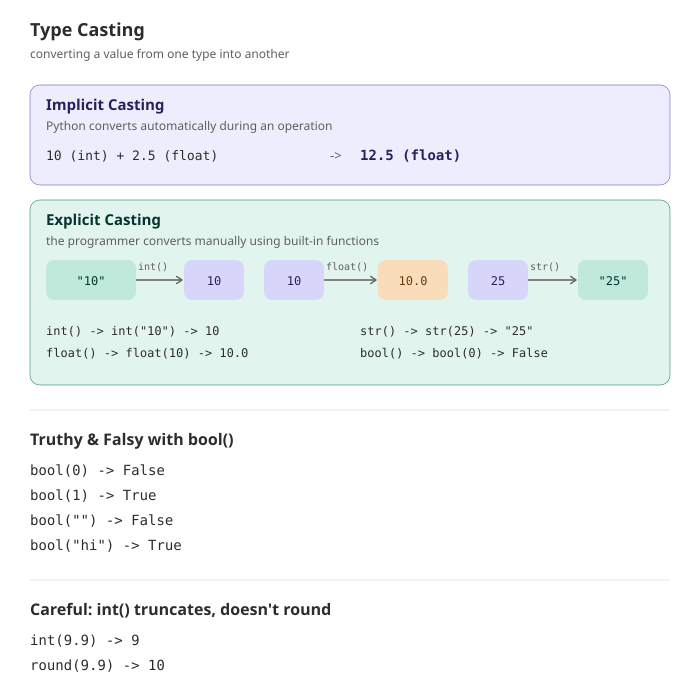

# Type Casting

## Overview

Type casting (also called **type conversion**) is the process of converting a value from one data type to another. Python provides built-in functions to convert between types like `int`, `float`, `str`, `list`, and more.

There are two kinds of type casting:
- **Implicit casting** — Python converts automatically.
- **Explicit casting** — the programmer converts manually using built-in functions.

---

## Syntax

```python
new_value = type_function(value)
```

```python
x = int("10")     # str -> int
y = float(5)       # int -> float
z = str(25)        # int -> str
```

---

## Visual Explanation


---

## 1. Implicit Type Casting

Python automatically converts a smaller/simpler type into a larger/compatible one during an operation — no data is lost.

```python
a = 10       # int
b = 2.5      # float
c = a + b    # Python automatically converts 'a' to float
print(c)     # 12.5
print(type(c))   # <class 'float'>
```

---

## 2. Explicit Type Casting

The programmer manually converts a value using built-in functions.

| Function | Converts to | Example | Result |
|---|---|---|---|
| `int()` | integer | `int("10")` | `10` |
| `float()` | float | `float("3.14")` | `3.14` |
| `str()` | string | `str(25)` | `"25"` |
| `bool()` | boolean | `bool(0)` | `False` |
| `list()` | list | `list("abc")` | `['a', 'b', 'c']` |
| `tuple()` | tuple | `tuple([1, 2, 3])` | `(1, 2, 3)` |
| `set()` | set | `set([1, 1, 2])` | `{1, 2}` |

```python
age = int("25")        # str -> int
price = float("9.99")  # str -> float
count = str(100)       # int -> str
flag = bool(1)          # int -> bool (True)
```

---

## Truthy and Falsy Values with `bool()`

```python
print(bool(0))       # False
print(bool(1))       # True
print(bool(""))      # False (empty string)
print(bool("hi"))    # True (non-empty string)
print(bool([]))      # False (empty list)
print(bool([1, 2]))  # True (non-empty list)
```

---

## Common Mistakes (and Fixes)

### 1. Trying to convert a non-numeric string to a number

```python
# Wrong - crashes with ValueError
age = int("twenty five")
```
```python
# Correct - only numeric strings can be converted
age = int("25")
```
`int()` and `float()` only work on strings that actually represent numbers.

---

### 2. Forgetting that `input()` returns a string

```python
# Wrong
num1 = input("Enter first number: ")
num2 = input("Enter second number: ")
print(num1 + num2)   # concatenates strings instead of adding numbers
```
```python
# Correct
num1 = int(input("Enter first number: "))
num2 = int(input("Enter second number: "))
print(num1 + num2)
```
Without converting, `+` joins the strings together instead of performing addition.

---

### 3. Losing decimal data when casting to `int`

```python
# Careful - int() truncates, it does not round
value = int(9.9)
print(value)   # 9, not 10
```
```python
# Use round() first if you want proper rounding
value = round(9.9)
print(value)   # 10
```
`int()` simply cuts off the decimal part; it doesn't round to the nearest whole number.

---

### 4. Assuming `bool()` follows intuition for all values

```python
# Common misconception
print(bool("False"))   # True, not False!
```
```python
# Correct way to check a string's actual meaning
text = "False"
result = text.lower() == "true"
print(result)   # False
```
Any non-empty string is truthy in Python — including the string `"False"` — because `bool()` checks whether the value is empty, not what it says.

---

### 5. Converting a list with mixed types incorrectly

```python
# Wrong - fails because "a" cannot become an int
numbers = ["1", "2", "a"]
converted = [int(n) for n in numbers]   # ValueError
```
```python
# Correct - validate before converting
numbers = ["1", "2", "a"]
converted = [int(n) for n in numbers if n.isdigit()]
print(converted)   # [1, 2]
```
Always check that a value can be converted before casting, especially inside loops.

---

### 6. Forgetting that casting doesn't happen automatically for user input

```python
# Wrong - assumes input() already returns a number
age = input("Enter age: ")
if age > 18:   # TypeError: comparing str with int
    print("Adult")
```
```python
# Correct
age = int(input("Enter age: "))
if age > 18:
    print("Adult")
```
Every value from `input()` must be explicitly cast before using it in numeric comparisons or math.

---

## Key Points

- Implicit casting happens automatically (e.g., `int` + `float` → `float`).
- Explicit casting is done manually using `int()`, `float()`, `str()`, `bool()`, `list()`, `tuple()`, `set()`.
- `int()` truncates decimals rather than rounding — use `round()` if rounding is needed.
- Not all strings can be converted to numbers — invalid conversions raise a `ValueError`.
- Non-empty strings are always truthy, even `"False"` — `bool()` checks emptiness, not meaning.

---

## Practice Questions

### Easy

1. Convert the string `"50"` into an integer and add `25` to it. Print the result.
2. Convert the integer `7` into a float and print its type.
3. Convert the number `100` into a string and print its type using `type()`.
4. Use `bool()` to check the truthiness of `0`, `1`, `""`, and `"hello"`. Print all four results.
5. Fix this broken code:
   ```python
   age = input("Enter age: ")
   print(age + 5)
   ```

### Intermediate

1. Take two numbers as input using `input()`, convert both to `float`, and print their product.
2. Convert the string `"3.99"` to a float, then to an int, and print both results. Explain what happens to the decimal part.
3. Given a list of strings `["10", "20", "30"]`, convert every item to an integer using a list comprehension and print the new list.
4. Create a tuple from the list `[1, 2, 3, 2, 1]`, then create a set from the same list. Compare the two outputs.
5. Predict the output and explain why:
   ```python
   x = int(7.8)
   y = round(7.8)
   print(x, y)
   ```

### Advanced

1. Write a program that takes a list of mixed strings like `["10", "abc", "20", "xyz"]`, filters out non-numeric strings, converts the rest to integers, and prints their sum.
2. Write a program that asks the user for their weight in kilograms (as a string via `input()`), safely converts it to `float` using `try`/`except`, and prints the equivalent in pounds (`kg * 2.205`).
3. Given `value = "True"` (a string), write code that correctly interprets it as an actual boolean (not just relying on `bool()`), and prints the result.
4. Write a function `safe_int(value)` that attempts to convert `value` to an `int`, returning `None` if it isn't possible. Test it with `"42"`, `"abc"`, and `"3.14"`.
5. Without running it, predict the output and explain why:
   ```python
   a = "10"
   b = 5
   print(int(a) + b)
   print(a + str(b))
   ```

---

## Next Module

Proceed to **Conditional Statements** to learn how Python makes decisions using `if`, `elif`, and `else`.